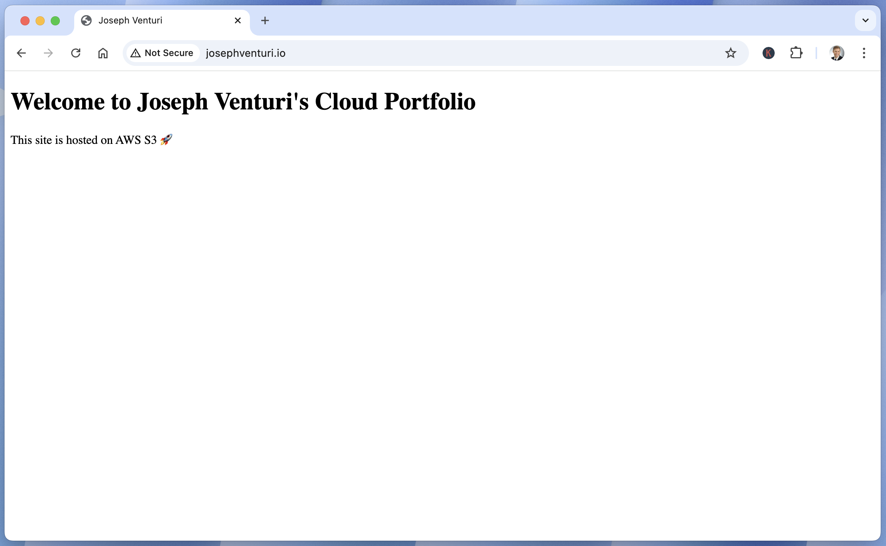
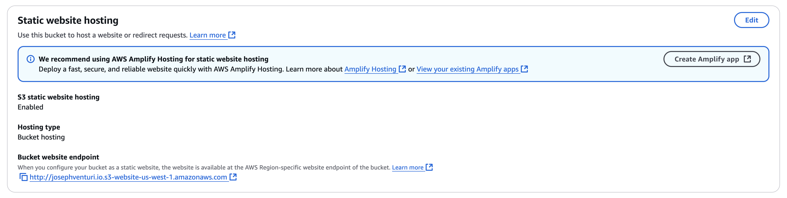
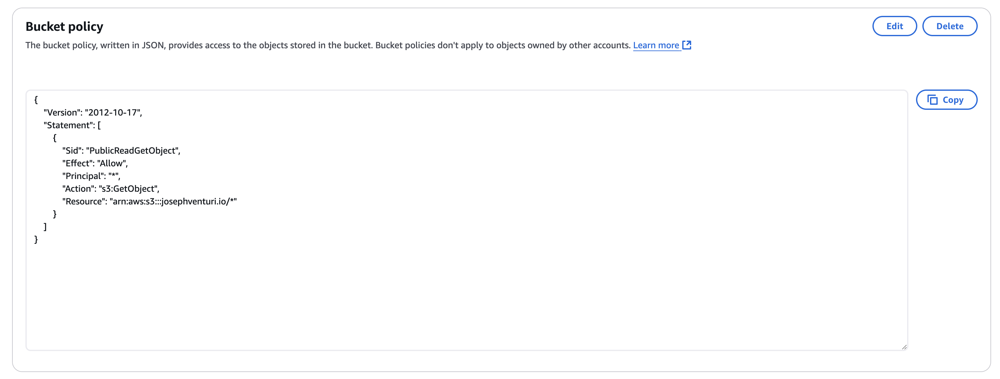
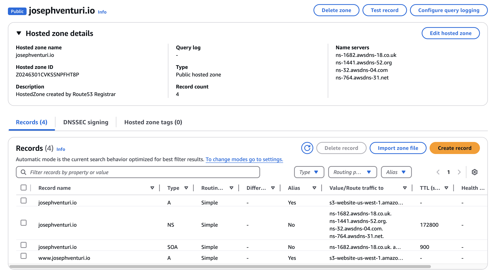

# Static Website Hosting on AWS S3

This is a simple static website hosted using **Amazon S3** and mapped to a custom domain (`josephventuri.io`) via **Route 53**.

## 🌐 Live Site  
➡️ [josephventuri.io](http://josephventuri.io)

## 📁 Files
- `index.html`: The static HTML file for the portfolio landing page.

## 🧰 Tools Used
- **AWS S3** – Hosting static content
- **Route 53** – DNS management
- **IAM** – Bucket policy for public access

## ⚙️ Features
- Publicly accessible static site
- Custom domain configuration with root and www redirection
- Basic file hosting via S3

## 🧠 What I Learned
- How to configure static website hosting in S3
- How to manage custom DNS using Route 53
- How to troubleshoot AWS hosting + permissions

## 📸 Screenshots

### 🖥️ Live Site Preview  

### 🪣 S3 Static Website Hosting  

### 🔐 S3 Bucket Policy  

### 🌐 Route 53 DNS Records  

